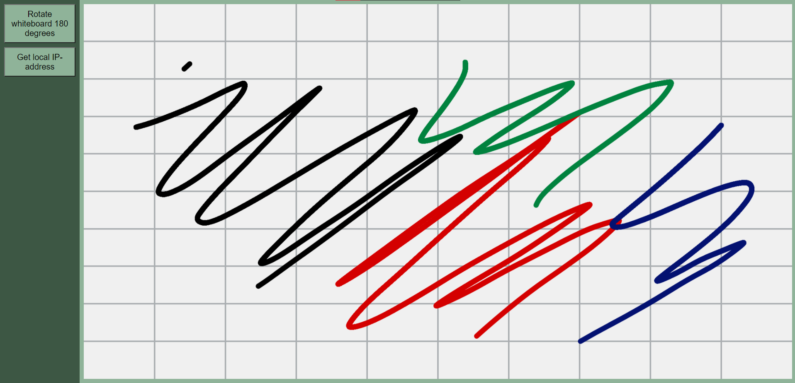

# Lecture Whiteboard

Draw on your android device and see the results on your windows pc!

## TODO's

* Add authentication to prevent others within local network to send POSTs
* Resize image when rotating 90 degrees
* Improve responsive webdesign
* Improve visuals

## Getting started

* Install Rust 1.52.0-nightly
* `git clone https://github.com/Denbergvanthijs/lectboard-server-rust`
* `cd lectboard-server-rust`
* `cargo run`
* Open [http://localhost:5000/](http://localhost:5000/) for the front-page of the webserver
* Writedown your local IPv4-address by pressing the _Get local IP-address_ button
* Install the _LectBoard_ app on your android device
* Fill in the local IP-address obtained from your PC
* Start drawing!

## Screenshots

